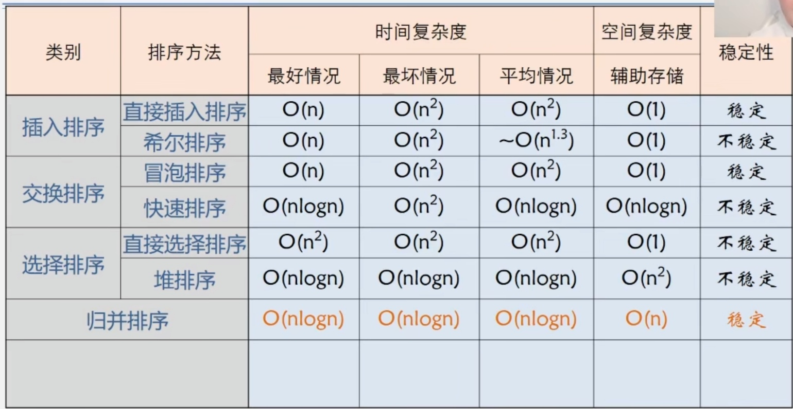

# 关于排序


<!--more-->
# 排序

1. 稳定性 (排序前A在B前B，排序后A=B，A仍在B前)

2. 内排序（排序记录均放置在内存中）与外排序：
   内排序性能:
   1. 时间性能：关键字比较次数及记录移动次数应尽可能少
   2. 辅助空间：存放待排序及算法运行所用空间
   3. 复杂性：算法复杂性影响排序性

```c++
#define MAXSIZE 10 //数组个数最大值
struct SqList{
    int r[MAXSIZE+1];//储存要排序的数组
    int length;
}
```


```c++
void swap(SqList *L,int i,int j){
    int temp=L->r[i];
    L->r[i]=L->r[j];
    L->r[j]=temp;
}
```


## 排序种类



插入排序：好：0 moves, n-1 comparisons  坏：（n-1）n/2 moves 和comparisons  					n位swap

归并排序：T(n)=2*T([n/2])+cn

快速排序： 坏：（n-1）n/2 moves comparisons

### 插入排序

1. 直接插入排序：将一个记录插入到已知有序序列中。

   ```c
   void InsertSort(SqList *L)
   {
       for(int i=2;i<L->length;i++)
       {
           if(L->r[i]<L->r[i-1])
           {
               L->r[0]=L->r[i];//哨兵r[0]用于存储需要插入的记录
               for(int j=i-1;L->r[j]>L->r[i];j--)//遍历必r[0]大的记录并后移
               {
                   L->r[j+1]=L->[j];              
               }
               L->r[j]=L->r[0];//将数据r[0]放入空位
           }
       }
   }
   ```

   

2. 希尔排序：设定一个增量序列（质数序列，递减，最终为1），将以每一个增量作为间隔的少数记录做一次直接插入排序，由基本有序逐渐完善到整体有序。

   ```c
   void ShellSort(SqList *L)
   {
       int increment=L->length;
       do
       {
           increment=incrament/3+1;
           for(int i=increment+1;i<=L->length;i++)
           {
               if(L->r[i]<L->r[i-increment])
               {
                   L->r[0]=L->r[i];
                   for(int j=i-increment;j>0&&L->r[0]<L->r[j];j-=increment)
                   {
                       L->r[j+increment]=L->r[0];
                   }
               }
           }
       }
       while(increment>1);
   }
   ```

   

   

### 交换排序

1. 冒泡排序：

2. 快速排序：设计一个中心枢纽，枢纽左边的都是比他小的，右边的都是比他大的。左右边部分继续设置枢纽，进行排序，依此递归。

   ```c
   void QuickSort(SqList *L)
   {
       QSort(L,1,L->length);
   }
   ```

   ```c
   void QSort(SqList *L,int low,int high)
   {
       int pivot;
       if(low<high)
       {
           pivot=Partition(L,low,high);
           QSort(L,low,pivot-1);
           QSort(L,pivot+1,high);
       }
   }
   ```

   ```c
   int Partition(SqList *L,int low,int high)
   {
       int pivotKey;
       pivotkey=L->r[low];
       L->r[0]=pivotkey;
       while(low<high)
       {
           while(low<high&&L->r[high]>=pivotkey){high--;}
           L->r[low]=L->r[high];
           while(low>high&&L->[low]<=pivotkey){low++}
           L->r[high]=L->r[low];
       }
       L->r[llow]=L->r[0];
       return low;
   }
   ```

   

### 选择排序

1. 直接选择排序

```c
void SelectSort(SqList *L)
{
int i,j,min;
for(i=1;i<L->length;i++)
{
    min=i;
    for(j=i+1;j<L->length;j++)
    {
        if(L->r[j]<L->r[min])
        {
            min=j;
        }
    }
    if(i!=min)
    {
        swap(L,min,i);
    }
}
}
```


1. 堆排序

```c
void HeapSort(SqList *L)
{
    int i;
    for(i=L->length/2;i>0;i--)
    {
        HeapAdjust(L,i,L->length);
    }
    for(i=L->length;i>1;i--)
    {
        swap(L,1,i);
        HeapAdjust(L,1,i-1);
    }
}
```

```c
void HeapAdjust(Aqlist *L,int s,int m)
{
    int temp,j;
    temp=L->r[s];
    for(j=2*s;j<m;j*=2)
    {
        if(j<m && L->r[j]<L->r[j+1])
        {
            ++j;
        }
        if(temp>=L->r[j])
        {
            break;
        }
        L->r[s]=L->r[j];
        s=j;
    }
    L->r[s]=temp;
}
```


###　归并排序

```c
void MergeSort(SqList *L)
{
    MSort(L->r,L->r,1.L->length);
}
```

```c
voidMSort(int SR[],int TR[],int s,int t)
{
    int m;
    int TR2[MAXSIZE+1];
    if(s==t)
    {TR1[s]=SR[s];}
    else
    {
        m=(s+t)/2;
        MSort(SR,TR,s,m);
        MSort(SR,TR,m+1,t);
        Merge(TR2,TR1,s,m,t);
    }
}
```

```c
void Merge(int SR[],int TR[],int i,int m,int n)
{
    if (SR[i]<SR[j])
    {
        TR[K]=SR[i++];
        
    }
    else{TR[k]=SR[j++];}
}
if(i<=m)
{
    for(l=0;l<m-i,l++
        {TR[k+1]=SR[i+1];}
}
if(j<=n)
{
    for(l=0;l<n-j,l++
        {TR[k+1]=SR[i+1];}
}
```

