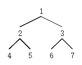

# 树的遍历之Morris遍历


<!--more-->

有一种巧妙的方法可以在线性时间内，只占用常数空间来实现树的遍历。这种方法由 J. H. Morris 在 1979 年的论文「Traversing Binary Trees Simply and Cheaply」中首次提出，因此被称为 Morris 遍历。核心思想是利用树的大量空闲指针，实现空间开销的极限缩减（和线索二叉树底层原理相同）。

### **1.熟悉Morris遍历的基本规则**

+ 在节点的遍历中，记当前节点为cur（由根节点开始）。

+ 如果cur无左孩子，cur向右移动（cur=cur->right）

+ 如果cur有左孩子，找到cur左子树上最右的节点，记为mostright

  如果mostright的right指针指向空，让其指向cur，cur向左移动（cur=cur->left）

  如果mostright的right指针指向cur，让其指向空，cur向右移动（cur=cur->right）

​	实现以上的原则，即实现了morris遍历，而在此过程中的变化的cur结点组成了**Morris序**。

​				-----以下图为例，根据遍历规则



1. *cur指向，按照morris原则的第二条第一点，它存在左孩子，cur左子树上最右的节点为5，它的right指针指向空，所以让其指向1，cur向左移动到2。*
2. *2有左孩子，且它左子树最右的节点4指向空，按照morris原则的第二条第一点,让4的right指针指向2，cur向左移动到4*
3. *4不存在左孩子，按照morris原则的第一条，cur向右移动，在第二步中，4的right指针已经指向了2，所以cur会回到2*
4. *重新回到2，有左孩子，它左子树最右的节点为4，但是在第二步中，4的right指针已经指向了2，不为空。所以按照morris原则的第二条第二点，cu'r向右移动到5，同时4的right指针重新指向空*
5. *5不存在左孩子，按照morris原则的第一条，cur向右移动，在第一步中，5的right指针已经指向了1，所以cur会回到1*
6. *cur回到1，回到头结点，左子树遍历完成，1有左孩子，左子树上最右的节点为5，它的right指针指向1，按照morris原则的第二条第二点，1向右移动到3，同时5的right指针重新指回空*
7. *3有左孩子，且它左子树最右的节点6指向空，按照morris原则的第二条第一点,让6的right指针指向3，cur向左移动到6*
8. *6不存在左孩子，按照morris原则的第cur一条，cur向右移动，在第七步中，6的right指针已经指向了3，所以cur会回到3*
9. *cur重新回到3，有左孩子，它左子树最右的节点为6，但是在第八步中，6的right指针已经指向了3，不为空。所以按照morris原则的第二条第二点，cur向右移动到7，同时6的right指针重新指向空*
10. *此时cur无左孩子，cur向右移动，cur为空，遍历结束*

​	**Morris序**：1->2->4->2->5->1->3->6->3->7

+ morris遍历

  ```c++
   void morris(TreeNode* root)
      {
          if(root==nullptr)return ;
          TreeNode* cur=root;
          TreeNode* mostRight=nullptr;
          while(cur!=nullptr)
          {   
              std::cout<<cur->val<<std::endl;
              mostRight=cur->left;
              if(mostRight!=nullptr)
              {
                  while(mostRight->right!=nullptr && mostRight->right!=cur)
                  {
                      mostRight=mostRight->right;
                  }
                  if(mostRight->right==nullptr)
                  {
                      mostRight->right=cur;
                      cur=cur->left;
                      continue;
                  }else mostRight->right=nullptr;
              }
              cur=cur->right;
          }
      }
  ```

  


###  2. **由Morris序可以发现**

+ 没有左子树的结点遍历了一次（4，5，6，7）有左子树的结点遍历了两次（1，2，3）

+ 在有左子树的结点遍历的两次之间，其左子树上的结点均遍历完成。
+ ps:实质上通过对树的空指针进行利用，此算法通过mostright右孩子的指向来判断是第几次到达节点，指向空为第一次，指向cur为第二次。
+ 在不同时机打印节点可将morris遍历加工为先中后序遍历

### 3. **morris遍历加工为先序遍历**（即在第一次遍历每个cur结点时打印）

+ 先序

  ```c++
  void morrisPre(TreeNode* root)
      {
          if(root==nullptr)return ;
          TreeNode* cur=root;
          TreeNode* mostRight=nullptr;
          while(cur!=nullptr)
          {   
              mostRight=cur->left;
              if(mostRight!=nullptr)
              {
                  while(mostRight->right!=nullptr && mostRight->right!=cur)
                  {
                      mostRight=mostRight->right;
                  }
                  if(mostRight->right==nullptr)
                  {
                      std::cout<<cur->val<<std::endl;//二次型结点的第一次访问
                      mostRight->right=cur;
                      cur=cur->left;
                      continue;
                  }else mostRight->right=nullptr;
              }else{
                  std::cout<<cur->val<<std::endl;//一次型结点的第一次访问
              }
              cur=cur->right;       
          }
  
      }
  ```

  

### 4. **morris遍历加工为中序遍历**（一次型结点访问时打印，二次型结点第二次访问时打印）

+ 中序

  ```c++
   void morrisMin(TreeNode* root)
      {
          if(root==nullptr)return ;
          TreeNode* cur=root;
          TreeNode* mostRight=nullptr;
          while(cur!=nullptr)
          {   
              mostRight=cur->left;
              if(mostRight!=nullptr)
              {
                  while(mostRight->right!=nullptr && mostRight->right!=cur)
                  {
                      mostRight=mostRight->right;
                  }
                  if(mostRight->right==nullptr)
                  {
                      mostRight->right=cur;
                      cur=cur->left;
                      continue;
                  }else{
                      mostRight->right=nullptr;
                      std::cout<<cur->val<<std::endl;//二次结点的第二次访问
                  }
              }else{
                  std::cout<<cur->val<<std::endl;//一次结点的第一次访问
              }
              //或者只在此打印std::cout<<cur->val<<std::endl;
              cur=cur->right;
              
          }
  
      }
  ```

  

### 5. **morris遍历加工为后序遍历**（较为复杂，分两阶段）

+ 遍历阶段：寻找二次型结点的第二次访问时刻进行处理，此时逆序打印其左子树右边界(注意左子树右边界不包括根节点)

+ 遍历后阶段：再逆序打印整棵树的右边界（此阶段注意要保证空间复杂度O（1），即不申请额外空间）

  ```c++
  void morrisPos(TreeNode* root)
      {
          if(root==nullptr)return ;
          TreeNode* cur=root;
          TreeNode* mostRight=nullptr;
          while(cur!=nullptr)
          {   
              mostRight=cur->left;
              if(mostRight!=nullptr)
              {
                  while(mostRight->right!=nullptr && mostRight->right!=cur)
                  {
                      mostRight=mostRight->right;
                  }
                  if(mostRight->right==nullptr)
                  {
                      mostRight->right=cur;
                      cur=cur->left;
                      continue;
                  }else{
                      mostRight->right=nullptr;
                      printEdge(cur->left);//二次结点的第二次访问
                  }
              }
              cur=cur->right;
          }
      printEdge(root);
      }
      //逆序打印根节点为root的树的右边界()
      void printEdge(TreeNode* root)
      {
        TreeNode* tail=reverseEdge(root);  
        TreeNode* cur=tail;
        while(cur!=nullptr)
        {
          std::cout<<cur->val<<std::endl;
          cur=cur->right;
        }
      reverseEdge(tail);
      }
      TreeNode* reverseEdge(TreeNode* root)//将边界看作链表，逆序打印
      {
          TreeNode* pre=nullptr;
          TreeNode* next=nullptr;
          while(root!=nullptr)
          {
              next=root->right;
              root->right=pre;
              pre=root;
              root=next;
          }
          return pre;
      }
  ```

  

### 6 .**复杂度分析**

+ 空间复杂度：O（1）（仅使用了有限的变量，并未开辟其他的内存）
+ 时间复杂度：O（n）（问：在遍历过程中，会寻找左子树右边界，这一过程时间复杂度会超过O（n）吗？答：不会，因为对于所有需要寻找左子树右边界的结点来说他们都会进行两次搜寻过程，全部进行后会发现所有的mostright互不相同，整体代价趋于O（n）故时间复杂度不会超过O（n））


